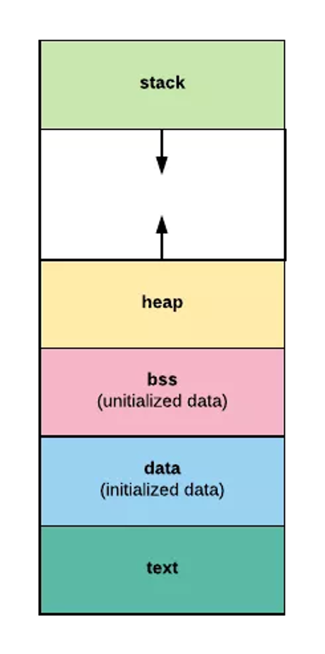
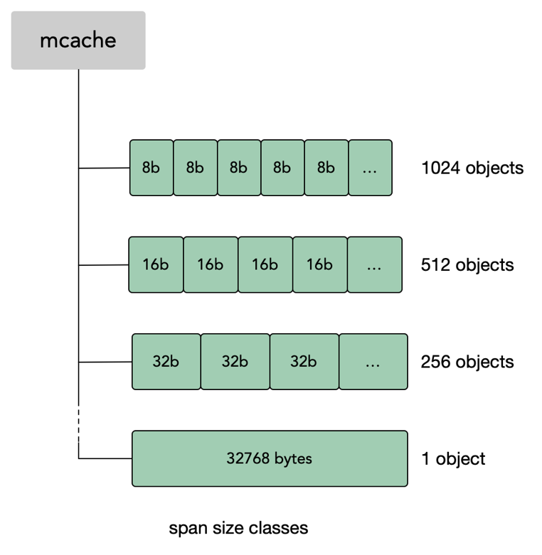

  
* 栈地址从高到低  
* 堆地址从低到高

# 内存逃逸
```shell
# 逃逸分析
go build -gcflags '-m'
```

* 超过函数的生命周期(函数返回指针)
* for 循环外申明，循环内分配  
* 闭包  
* channel 中存指针
* slice扩容
* interface类型上调用方法

# 栈
* goroutine维护自己的栈区  
初始大小2K，扩容最大至1G  
* 分段栈  
空间连续跳跃hot split严重影响性能
* 连续栈  
复制栈的方式实现(两倍)  
旧栈指针指向新地址  
    * 通过预测计算在特定地方插入指令检测是否用足够空间

# 内存管理
* 内存碎片
* 大锁

概念
* page  
8K 以page为单位申请和释放
* span  
一个或多个page组成一个span
* sizeclass  
空间规格
* object  
存一个变量的空间
  
span按一定规格划分，把相同大小的变量存储到同一span中  

mcache 挂载到P上  
同一时间P上只有一个G在运行，可以避免加锁
* 本地P中没有大小合适的空间可分配时  
去全局维护的mcentral中取span(此处要加锁)  
再去操作系统申请
* sizeclass  
从8b到32K  
    * 大于32K直接去操作系统申请
    * 小于16字节且不是指针的对象  
    挤一挤分配到16b中  
    如：一个4b对象还剩12b，可以再挤一个8b


