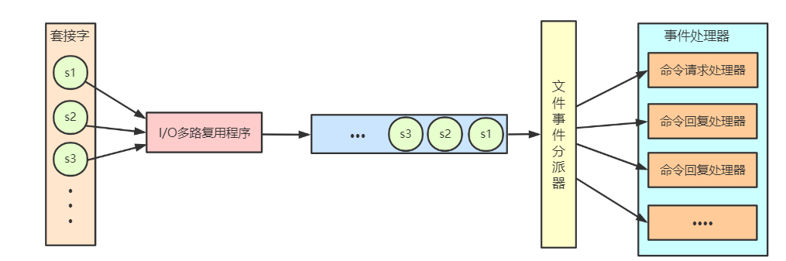

# 第十二章

Redis服务器是事件驱动程序，服务器需要处理两类事件：
* 文件事件  
    Redis服务器通过socket来处理来自客户端的命令是文件事件
* 时间事件    
    时间事件用来处理定时任务

## 文件事件

    

12-1 文件事件处理器
  

文件事件处理器通过但线程方式运行，
socket通过I/O多路复用来监听。  
socket通过I/O多路复用，放到一个队列里，如上图蓝色部分。  
文件事件分派器从队列中去一个分给事件处理器。等事件处理器处理完一个事件后分派器再分一个任务给处理器。  

* I/O多路复用  
Redis对常见的select、epoll、evport、kqueue都做了实现。
程序在编译时会选择系统中性能最高的方式来实现I/O多路复用。

* 事件处理器
    * 连接应答处理器  
    处理客户端连接服务器的任务
    * 命令请求处理器  
    接收客户端传来的命令
    * 命令回复处理器  
    向客户端返回命令处理的结果
    * 复制处理器  
    用于主从复制

## 时间事件

时间事件分为两种：   
* 定时事件  
    定时事件是在指定时间点执行
* 周期性事件  
    周期性事件是周期性的每隔一段时间

要执行的事件存在一个无序链表中，无序链表的元素包含三个字段，
id全局唯一标识（递增），when下次执行的时间（ms时间戳），timeProc应该执行的函数。  
因为是无序链表，所以需要每次遍历整个链表才能知道哪些任务需要执行。
但正常模式下redis服务器只有一个时间事件serverCron，benchmark下也只有两个，所以遍历不影响性能。  
serverCron中包含的任务有： 
* 更新服务器的各类统计信息，如内存占用等
* 持久化操作（AOF/RDB）
* 清理过期键值对
* 关闭失效客户端
* 主从同步
* 集群同步、连接测试

[目录](./0.md)
