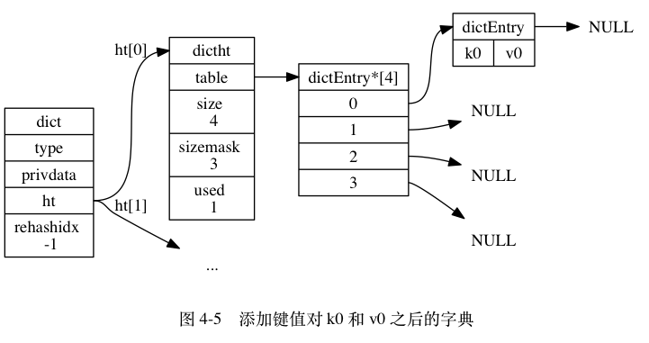

# 第四章

* 字典在很多地方叫map  

Redis的数据类型hash（哈希）就使用了字典  

Redis中的字段采用数组加链表的形式，先对 `key` 求hash值，
再对哈希求余，算出该数据应在数组的哪个索引下，如果该位置已经存在其他数据，
则以链表的形式相连。与java中的HashMap相似。

## 数据结构
```c
dictht struct {
    table    []dictEntry // 保存键值对的哈希数组
    size     long        // 哈希表大小
    sizemask long        // size-1，用于计算哈希索引
    used     long        // 已有元素数量
}

dict struct {
    ht        [2]dictht // 长度2的数组
    rehashidx int       // 扩容迁移时使用，平时为-1
}

```
size = 2^n



## 扩容  

* 什么时候扩容：  
负载因子 = used / size
    * 常规情况，负载因子 >= 1 时扩容
    * 如果正在执行BGSAVE或BGREWRITEAOF命令，则负载因子 >= 5 时扩容，
    目的是减小服务器负担  
    * 负载因子 < 0.1 时收缩


* 怎么扩容：  
    * 简述：原数据在ht[0]中，扩容时给ht[1]分配两倍于ht[0]的空间（2*size)  
        1. 把ht[0]中的数据rehash，重新计算分配到ht[1]中
        2. 释放ht[0], ht[0] = ht[1], ht[1] = null
    * 渐进是扩容：并不是一次完成迁移而是分多次，
    rehashidx的作用是记录当前迁移的位置，对应的是ht[0].table的下标索引
    * 新添加的数据会直接添加到ht[1]中，保证ht[0]的数量只会减少不会增加

[目录](./0.md)
