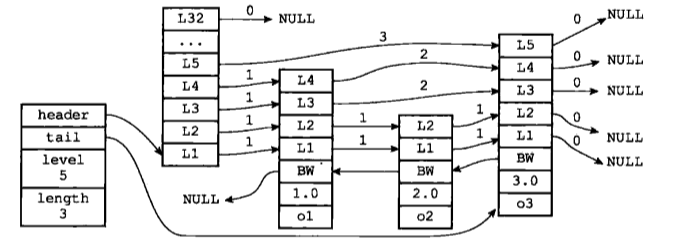
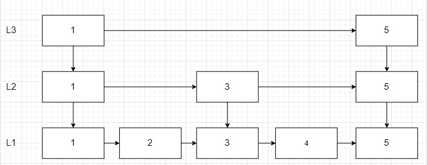
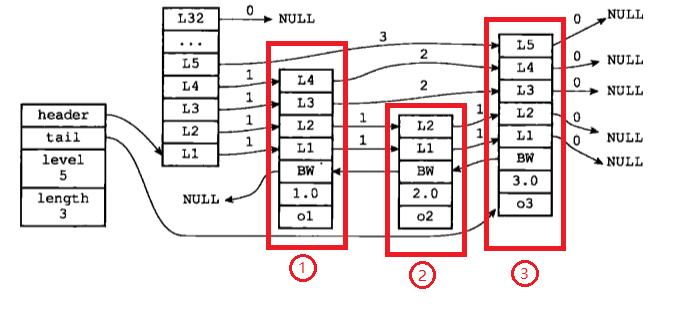

# 第五章

* 跳跃表  
Redis中有序集合使用的是跳跃表

刚看到书上这个图时，没反应过来跳跃表时个什么结构
   

5-1
  

我觉得下面这个图更容易让我理解跳跃表结构  
  

5-2
  
L1是实际数据，是一个链表结构，L2是L1链表的索引，L3是L2的索引。
这样若果要找到4，则1->3->4可以跳过部分(2)，不需要从链表头一个一个遍历。  

了解了跳跃表结构，在回来看一下书中这个图的意思。  
  

5-3
  
图中有三个节点1、2、3我已经用红框标出来了，
我们可以从下往上看，最下面一层o1、o2、o3分别是实际数据元素(value)，第二层是数字1.0、2.0、3.0是各自节点的分数(score)，
第三层BW是一个指向前一个节点的指针，
再往上L1、L2、L3...则是分层索引，相当于上面那个图(5-3)的L2和L3  
最左边的这个结构，header指向的是一个指向头节点的索引，tail指向尾节点，level是这个结构中要到的最大索引层数，第三个节点最上面是L5索引level=5，length是长度，图中共三个节点所以length=3

> 在有序集合中score可以重复，但value不能重复，score相同时根据value排序。

看懂了上面这个图，书中第五章的内容也就基本弄懂了  

[目录](./0.md)
