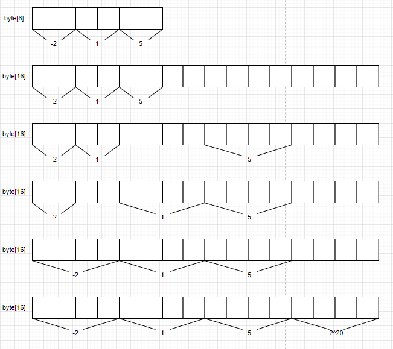

# 第六章

* 整数集合  
当一个集合只有整数且元素数量不多时Redis底层就会采用整数集合来实现  

## 数据结构
```c
intset struct {
    encoding uint32 // 编码方式
    length   uint32 // 元素数量
    contents []int8 // 保存元素的数组
}
```  
> 解释一下上面的结构：  
encoding编码方式也就是整数int的类型，包括16位、32位和64位  
length就是集合中元素的数量   
contents是元素数据，我刚看到这个结构还以为只能存8位整数不能存16、32位整数。
实际上我觉得用`[]byte`表示更容易理解，比如：当encoding选为16位整数时，contents数组中连续两个元素表示一个16位的整数，此时contents数组长度 = 2 x length。32位64位整数也是同样的道理。

## 升级
* 什么时候需要升级  
新元素的类型比整数集合现有所有元素的类型都要长时， 需要先进行升级  
举个例子：  
现在集合中只有[-2, 1, 5]三个元素，那么redis就会用16位的整数集合来存储。这时候如果添加了一个新元素，这个新元素大于2^15 -1，16位整数装不下这个元素，那么就需要升级成32位或者64位的整数集合。  

* 如何升级  
    1. 根据新元素的类型， 扩展整数集合底层数组的空间大小， 并为新元素分配空间
    2. 将底层数组现有的所有元素都转换成与新元素相同的类型， 并将类型转换后的元素放置到正确的位上， 而且在放置元素的过程中， 需要继续维持底层数组的有序性质不变
    3. 将新元素添加到底层数组里面

下面我用一个图来表示如何进行升级还是上面的例子[-2, 1, 5]添加一个新元素2^20，
整数集合从int16升级到int32   


> 整数集合不支持降级操作

[目录](./0.md)
