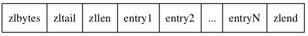
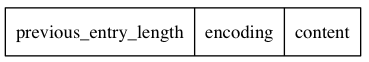

# 第七章

* 压缩列表(ziplist)  
压缩列表在redis列表和哈希中使用，当列表和哈希中元素是整数或短字符串时使用  
元素较多时则使用<a href="./3" target="_blank">链表</a>和<a href="./4" target="_blank">字典</a>  

## 数据结构
  

7-1
    

**zlbytes** (uint32):整个压缩列表所占字节数量   
**zltail** (uint32): 压缩列表头 到这个 压缩列表的最后一个节点 的距离（字节数），可以直接跳转到尾节点 entryN  
**zllen** (uint16) : 这个压缩列表中元素节点的数量，若果节点数量超过UNINT16_MAX，则zllen = UNINT16_MAX，这时要得节点数量只能遍历所有节点  
**zlend** (uint8) : 总是为0xff，相当于是这个压缩列表的结束符   
**entry** : 这个压缩列表中各节点，每一个节点的长度是可变的  

### entry 结构  
  

7-2
  

**previous_entry_length** (1字节或5字节): 上一个节点的长度，知道当前节点的位置，又知道上一节点的长度，就可以直接访问到上一节点。想访问下一节点则按顺序遍历就可以，这样既可以访问上一节点又可以访问下一节点，实现了和双向链表相似的功能  
**encoding** : 记录数据的类型和长度。  
**content** : 节点的值，记录的整数或短字符串  

## 连锁更新
因为节点中 `previous_entry_length` 的值受前一个节点长度影响，且长度不是一定的（1或5字节），那么如果前一个节点发生变化，可能使本节点的 `previous_entry_length` 所占字节也发生变化这样，这个节点的长度也同时发生变化，又可能影响下一个节点。使得产生连锁反应，但出现这种情况的机会很少。
